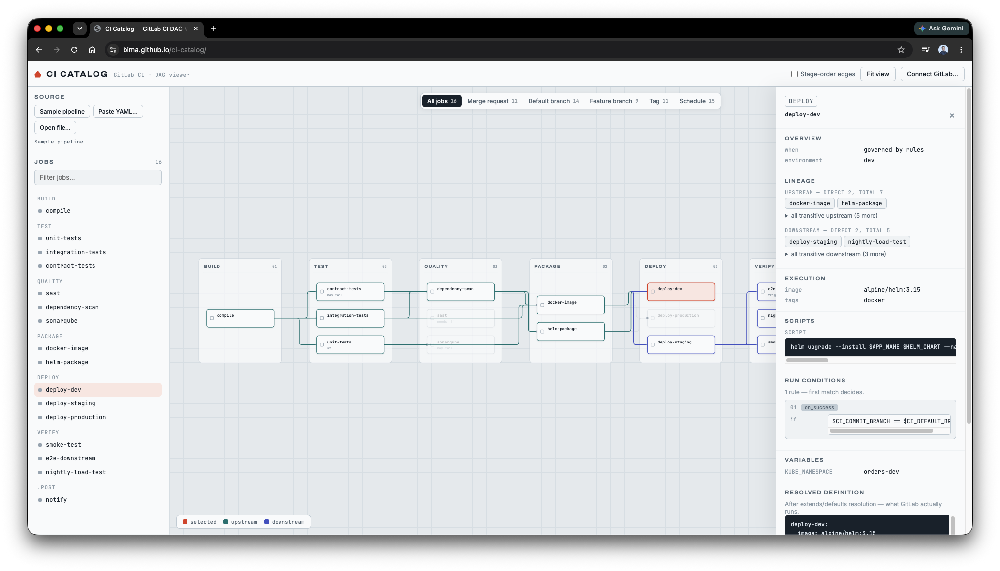
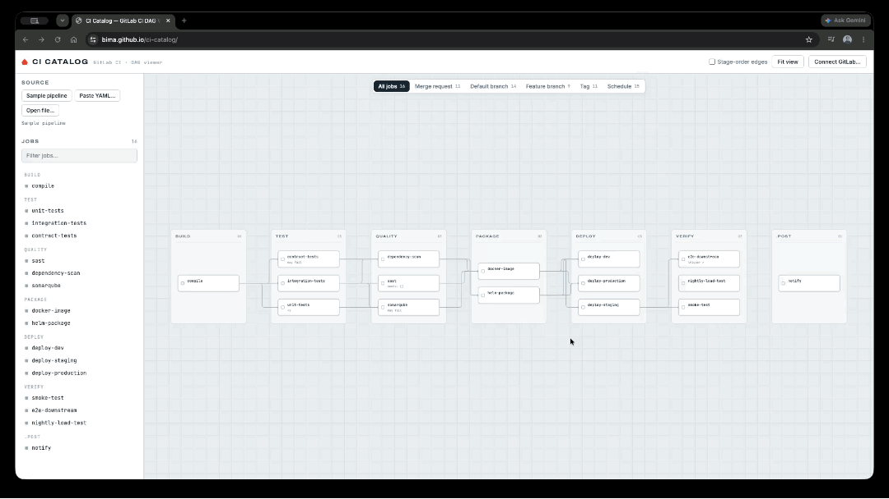

# CI Catalog — GitLab CI DAG Viewer

A dbt-Catalog-style explorer for GitLab CI/CD pipelines: load a `.gitlab-ci.yml`
and get an interactive dependency graph with per-job metadata, documentation,
and lineage.

> **Unofficial.** Not affiliated with, endorsed by, or sponsored by GitLab Inc.
> "GitLab" is a trademark of GitLab Inc. This project parses the CI/CD YAML
> format for visualization only. Config resolution approximates GitLab's
> semantics — and ships an [oracle harness](#correctness) that diffs it
> against GitLab's own CI Lint API so you can verify it on *your* templates
> instead of taking it on faith. Verified to produce identical job sets,
> stages, `needs`, and `when` on a 25-template enterprise pipeline library
> (~250 jobs) — the only intentional difference: rules-gated includes are
> shown (the catalog displays all possible jobs; GitLab skips them when the
> gate variable is unset).

**[Live demo »](https://bima.github.io/ci-catalog/)** — loads a sample Java +
Kubernetes pipeline; switch ref contexts, click jobs, explore lineage.

[](https://bima.github.io/ci-catalog/)

Two ways to use it, like dbt:

- **Generate a catalog** from a project of templates, then open the static
  output — the recommended flow for a repo of pipelines (see below).
- **Ad-hoc** — run the dev server and paste/open/fetch a single pipeline.

## Generate a catalog (dbt-docs style)

Parse a whole project of `.gitlab-ci.yml` templates into a static, shareable
catalog. Every root-level `*.yml` becomes a pipeline entrypoint; nested dirs
(`library/`, `templates/`, …) are resolved as `include: local`.

```sh
npx ci-catalog generate /path/to/pipeline-repo   # parse project → static catalog
npx serve pipeline-docs                          # open the catalog
```

Non-local includes are fetched at generate time and resolved into the graph:

- `include: project` — via the GitLab API (`--gitlab-url`, defaults to
  `$CI_SERVER_URL` or gitlab.com; set `GITLAB_TOKEN` for private projects —
  the token is only ever sent to the configured GitLab host, never to hosts
  named inside the YAML being cataloged)
- `include: component` — CI/CD catalog components, including `@~latest`
- `include: template` — GitLab's bundled templates
- `include: remote` — plain HTTP

Fetched files can include further files; resolution iterates to a fixpoint.
`--offline` skips all fetching (unresolved includes become warnings, like
before).

Output in `pipeline-docs/`:

- `manifest.json` — every pipeline pre-parsed (model, stages, jobs, warnings)
- `index.html` + assets — the viewer, which loads `manifest.json` on open

The shipped viewer does **no** YAML parsing — all parsing happens once at
generate time. The build excludes the dev-only starter templates, so the
catalog only contains the project you pointed it at.

Options: `-o <dir>` output directory (default `pipeline-docs`),
`--gitlab-url <url>`, `--offline`, `--build`/`--no-build` (force/skip
rebuilding the viewer — the npm package ships a prebuilt one).

## Correctness

`npm test` runs the parser/evaluator suite (extends merge semantics,
`!reference` splicing, includes, `rules:if` three-valued logic, the generate
CLI end-to-end).

`npm run test:oracle` diffs this parser against **GitLab's own CI Lint API**
(`POST /projects/:id/ci/lint` with `include_merged_yaml`) — GitLab resolves
the config with its real compiler, and the script compares job sets, stages,
`needs`, and `when` against ours:

```sh
GITLAB_URL=https://gitlab.example.com \
GITLAB_PROJECT=your-group/your-project GITLAB_TOKEN=… \
  node test/oracle.mjs path/to/templates/*.yml
```

`GITLAB_PROJECT` (path or numeric ID) provides the resolution context —
`include: local` resolves against that project's committed default branch, so
run it against a clean checkout of the same commit. Local includes are
resolved from each file's directory on our side too, so whole template repos
can be verified in one run.

Any divergence is reported per job, GitLab's merged config is dumped to
`.oracle/<file>.merged.yml` for inspection, and the script exits non-zero.
`--ignore-extra-jobs` tolerates jobs that only exist on our side — the one
intentional divergence: the catalog resolves rules-gated includes
(`include: … rules: if: $FLAG == 'true'`) that GitLab skips when the flag is
unset, because a catalog should show every job that *can* exist.

Latest run against a real enterprise template library: **25/25 pipelines,
~250 jobs, identical to GitLab's merge output** (modulo gated includes
above). Use it on your own templates before trusting the graph.

## Ad-hoc (dev server)

```sh
npm install
npm run dev
```

- **Sample pipeline** — built-in realistic example
- **Local templates** — dev-only dropdown of templates dropped under
  `starters/example/` (gitignored); excluded from production builds
- **Paste YAML / Open file** — any `.gitlab-ci.yml`
- **Connect GitLab…** — fetches the CI config and the latest pipeline's job
  statuses from a GitLab instance via the REST API (token optional for public
  projects, needs `read_api` scope, kept in memory only). Job statuses are
  overlaid on the graph and job list.

## What it understands

- `stages` ordering (plus `.pre` / `.post`), jobs grouped into stage lanes
- `needs` — explicit DAG edges, including `optional:` and `needs: []`
  (starts immediately); cross-pipeline/project needs are flagged, not drawn
- Implicit stage-ordering dependencies for jobs without `needs`
  (dashed wires, toggleable in the top bar)
- `extends` chains with GitLab merge semantics (hashes deep-merge, arrays
  replace), YAML anchors and `<<:` merge keys
- `default:` section and legacy top-level defaults (`image`,
  `before_script`, …)
- Hidden `.template` jobs, `parallel` / `parallel:matrix`, `trigger`,
  `when: manual`, `allow_failure`, `rules` / `only` / `except`, artifacts,
  cache, services, environments
- `include:` — `local:` resolved recursively with include-level `inputs:`;
  `project:` / `template:` / `remote:` / `component:` fetched at generate
  time (see above) and resolved the same way; anything unfetchable is flagged
  as unresolved. `spec: inputs:` template headers with `$[[ inputs.x ]]`
  interpolation; `!reference [job, key]` tags resolved against the merged
  config

## Ref contexts

Tabs above the canvas simulate which jobs run per ref: **All jobs · Merge
request · Default branch · Feature branch · Tag · Schedule**. Job `rules:if`,
`only`/`except` (refs + variables) and `workflow:` are evaluated with
three-valued logic against each context's predefined CI variables. Jobs whose
conditions depend on project variables (or `changes:`/`exists:`) are kept and
drawn dashed with a "conditional" badge. The default-branch context matches
`main` *and* `master` (union), since templates target both.

## Explore



- Click a job (graph or sidebar) → detail drawer: overview, direct +
  transitive lineage (clickable), execution context, scripts, run conditions,
  artifacts, variables, and the fully resolved YAML definition
- Selecting a job highlights lineage directionally — upstream teal, downstream
  indigo, selected red (legend bottom-left); transitive lists expandable in
  the drawer
- `/` focuses the job filter; `Esc` clears selection; drag to pan,
  scroll to zoom, **Fit view** to reset

## Stack

Vite + vanilla JS + `js-yaml`. Custom layered layout (stage columns,
barycenter crossing reduction) and SVG rendering — no graph library.

## License

[MIT](LICENSE) © Bimantara Hanumpraja
